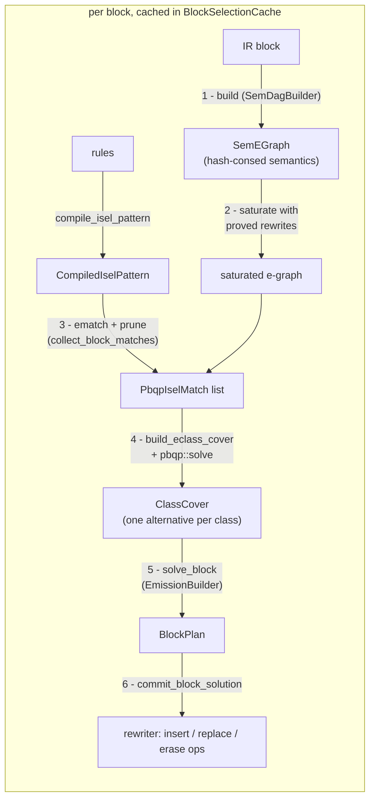

# Instruction Selection

Instruction selection (`backends/common/src/isel/`) turns target-independent IR
into target instructions. It is **e-graph + PBQP**: each basic block is lowered to
a semantic e-graph, saturated with proved algebraic identities, tiled against the
target's instruction patterns, and the cheapest legal cover is found by solving a
Partitioned Boolean Quadratic Problem (PBQP).

Nothing in the pass hardcodes a semantics, cost, or rule. A target supplies a list
of `Rule`s (a semantic pattern + an emitter) and an optional cost model; the pass
does the rest.

## Module layout

| module | responsibility |
|--------|----------------|
| `isel/mod.rs` | public API (`Rule`, `EmitRequest`, cost-model traits), the pass driver and per-block cache |
| `isel/node.rs` | the `SemNode` label, `SemPayload`, and e-class helpers (`class_binding`, widths) |
| `isel/builder.rs` | `SemDagBuilder`: IR ops → semantic e-graph, including memory effects |
| `isel/pattern.rs` | `compile_isel_pattern`: rule semantics → `tir_symbolic::egraph::Pattern`s + per-node metadata |
| `isel/axioms.rs` | s-expression axioms and their compilation into proved rewrites |
| `isel/synthesis.rs` | offline discovery of bridge axioms by enumeration (`discover_axioms`) |
| `isel/rewrites.rs` | the built-in boolean bridges (`discover_rewrites`), saturation driver |
| `isel/cover.rs` | PBQP construction, match dominance pruning, completeness check |
| `isel/emit.rs` | `BlockPlan` and `EmissionBuilder`: cover → per-op decisions |

## Pipeline



The pass runs per function. The first op it visits in a block triggers
`commit_block_solution`, which builds and solves the **whole block** at once
(`emitted_blocks` guards against re-emitting). Results are memoized in
`block_cache` keyed by `BlockId`, so building and solving each happen once.

## 1. Building the semantic e-graph

`SemDagBuilder` lowers every op in the block into one shared
`SemEGraph = EGraph<SemNode, ()>`. There is no separate DAG arena: the e-graph
hash-conses, so it *is* the interned semantic DAG, and identical sub-expressions
across ops collapse to one e-class (CSE for free).

### What a node is

An e-node is a **label** plus its **operand e-classes**. The label is a
`SemNode`:

```rust
struct SemNode { kind: ExprKind, payload: Option<SemPayload>, ty: Option<TypeId> }

enum SemPayload {
    Expr(ExprPayload), // a semantic constant / symbol / value
    Opaque(u32),       // a unique, never-merging marker (see below)
}
```

Structure (the operands) lives in the e-node's child classes, never in the label.
So two e-nodes are congruent iff they share a label *and* the same operand classes
— exactly what `PartialEq`/`Hash` compare. `ty` is the verbatim IR type (no width
normalization), so every target can constrain on the widths it distinguishes.

```
   add : i32                       a SemNode label is just (kind, payload, ty);
   ┌──────────┐                    operands are edges to child classes
   │ kind=Add │
   │ ty =i32  │ ──┬──► class[x]    (symbol, ty=i32)
   └──────────┘   └──► class[y]    (symbol, ty=i32)
```

`ExprKind` / `ExprPayload` come from each op's `semantic_expr` (the sem-DSL), so a
multi-node expansion (e.g. a load becomes `LoadMemory(add(addr, 0), bytes,
meta)`) lands as several e-nodes.

### Opaque payloads: things that must never merge

`SemPayload::Opaque(serial)` makes a node label unique, defeating hash-consing
and saturation's congruence repair, while still matching any untyped pattern
node of the same kind (a pattern payload of `None` is a wildcard). It is used
for:

- **un-lowerable sub-expressions** (`add_opaque`): two unknown computations are
  never assumed equal;
- **memory effects and their addressing wrappers** (`add_op_unique`): loads are
  not pure values (two loads of one address differ across an intervening
  store), so their e-classes must never merge; the synthetic `addr + 0`
  wrapper stays private to one memory op for the same reason.

### Memory ops

Ops implementing `MemoryRead` / `MemoryWrite` are lowered by
`build_memory_effect` into `LoadMemory` / `StoreMemory` nodes whose address is
wrapped as `addr + 0` so the targets' base+offset addressing patterns
match a bare pointer. The interfaces are the only trigger; there is no op-name
matching.

### Side tables produced by the build

| table | meaning |
|-------|---------|
| `op_by_root: EClassId → OpId` | the **earliest** op whose result the class produces |
| `op_root: OpId → EClassId` | every op's canonical root class (total, unlike `op_by_root`) |
| `class_value: EClassId → ValueId` | the IR value a class computes (so an interior result can be re-materialized as a register) |
| `shared_classes: Set<EClassId>` | a value used as an operand by **>1 consumer**; a memory effect here can never be internalized into a larger match (a pure value still can — duplication) |
| `must_materialize: Set<EClassId>` | an op-root class whose value is used by an op no match reaches (return, branch, un-lowered, another block); it is never offered a consuming alternative |

When saturation merges two value-carrying classes (the values are provably
equal), both maps deterministically keep the **earliest-defined** op/value: it
dominates every later use in the block.

## 2. Saturation with proved rewrites

Before tiling, the e-graph is saturated with target-independent algebraic
identities (`self.rewrites`). These are **not** hand-written selection rules — they
are bit-vector lemmas the target's own instructions happen to realize, expressed
as s-expression axioms (`isel/axioms.rs`):

```
(axiom sext-bridge
  (vars (x n)) (root w) (where (< n w))
  (lhs (sext x w))
  (rhs (ashr (shl x (- w n)) (- w n))))
```

Nobody writes these by hand either: the `tir axioms` developer utility
*discovers* them (`isel/synthesis.rs`) whenever a backend's instruction set
changes. Discovery enumerates candidate terms over the target's atomic
instruction kinds, directly in the axiom language (constant leaves are width
expressions, so candidates are width-parameterized by construction), prunes by
behavioral fingerprint over sampled inputs at several `(n, w)` pairs, and
accepts the smallest candidate the `SmtOracle` proves at every sampled pair.
The result is committed as `backends/<t>/src/isel.axioms`, installed by the
backend through `with_axioms`, and guarded by a per-backend freshness test
that re-runs discovery and diffs the file. `with_axioms` drops any axiom whose
RHS needs a kind the rule set has no atomic instruction for, so a stale file
degrades coverage, never correctness.

The compiled applier resolves the axiom's width names from the matched classes
(`n` from `x`'s class, `w` from the root), checks the guards, and **proves the
exact width instantiation** with the `SmtOracle` (an unsat check through
`tir-symbolic`'s QF_BV bit-blaster, memoized per instantiation) before it
unions — so there is no gap between the lemma proved and the rewrite applied.
The proof models each operand as the low `n` bits of a full-width register the
RHS reads whole, covering the undefined upper register bits the emitted
instructions actually see. The extension axiom asserts:

```
   SExt(v, W)   ──rewrite──►   ShiftRightArithmetic( ShiftLeft(v, W-n), W-n )
                                                            with n = width(v)
```

After `egraph.union`, the `SExt` class *also contains* the shift-pair form, so a
target with no sub-word sign-extend instruction can still cover it via shifts. The
introduced shift nodes are untyped, so they match width-agnostic shift patterns.

> Saturation may merge classes, so `op_by_root` and `class_value` are
> re-canonicalized through `egraph.find` afterwards (earliest definition wins,
> see §1).

## 3. Patterns and matches

Each `Rule`'s pattern is compiled once (`compile_isel_pattern`) into a
`tir_symbolic::egraph::Pattern<SemNode, u32>`. Operand leaves become
`Var::Symbol` holes (capture points — the match's substitution binds them);
interior nodes become typed/untyped templates, with per-node register /
immediate / width requirements kept in `node_meta`. `specificity` counts
type-constrained nodes — the tie-breaker (see below).

`collect_block_matches` e-matches every pattern against the saturated e-graph
(via the shared `tir_symbolic::egraph` search engine — the same matcher
instcombine uses — with operand constraints and match legality supplied as a
legality callback),
producing a `PbqpIselMatch` per hit:

```rust
struct PbqpIselMatch {
    pattern_index, rule_index,
    root: EClassId,           // class this match would compute
    pattern_root: NodeId,
    bindings: FullMatchBindings,  // pattern_node → class, + symbol → class captures
    cost: u64,                    // the cost model's node cost, unmodified
}
```

A match rooted at a pure operand (leaf/constant) is discarded — instructions root
at *computed* values only. A pure class may sit interior to any number of
matches (each fused instruction recomputes it); a shared *memory effect* (§1)
is allowed as a match root or boundary, but never as an interior node a larger
match would erase.

### Width-sensitive operands

A boundary may carry a **width requirement** (`Rule::with_operand_widths`,
compiled to `Pattern::operand_width`): the bound class must hold a value of
exactly that width, or one of *unknown* width (a rewrite-introduced
intermediate, produced at register width by whatever materializes it). TMDL
derives these for operands whose upper register bits reach the result —
comparison operands always; right-shift values and division/remainder operands
under an *untyped* node (a typed word form like `sraw` already pins its
operands through width inference) — resolving the width from the operand's
register class per enabled features (XLEN: 64 on rv64, 32 on rv32). So an i32
compare fuses into `blt` on rv32 but is *refused* on rv64 (a 64-bit compare
would read undefined upper bits) instead of miscompiling.
Low-bits-preserving operators (add/and/shl/mul-low) stay width-agnostic.

### Immediate ranges

An immediate boundary additionally carries its **encoding range**
(`Rule::with_operand_imm_ranges`): the field's bit width from the TMDL operand
type (`imm: bits<12>`), signedness from how the behavior consumes the symbol
(`sext(imm, _)` is signed, everything else unsigned), and an
`extract(imm, hi, 0)` shift-amount mask narrows the usable bits. A constant
outside the range must not bind — its encoding would silently truncate — so
`addi x, 2047` folds while `addi x, 2048` refuses the immediate rule (and,
with no wide-constant materializer in the rule set, fails selection loudly).

### Narrow register-width forms

An instruction whose destination register class is statically narrower than
the architectural registers (x86 `add32`/`add16`/`add8` on
`GPR32`/`GPR16`/`GPR8`) defines exactly that many bits: TMDL types the
pattern root at the class width, so each narrow form matches only values of
its width and wins the specificity tie-break below against the untyped
full-width form (which keeps matching every other width).

### Dominance pruning (specificity)

Before the solve, `prune_dominated_matches` deduplicates interchangeable
matches: among matches with the same root class, the same internal-class
coverage, and the same boundary operands, the one that is no cheaper *and* no
more specific is dropped. So at **equal cost** the type-constrained rule wins
(an `i32 addw` beats the untyped `add`), while a genuinely cheaper instruction
still wins on cost alone — and specificity never distorts the PBQP objective.

## 4. The PBQP cover

`build_eclass_cover` maps the tiling problem onto PBQP: **one PBQP node per
e-class**, each offering a set of **alternatives**:

```
   PbqpIselAlternative
   ├─ External                       leaf, or a value materialized in a register
   ├─ Root { match_id }              this class is the instruction's result   ← cost lives here
   ├─ Internal { match_id, p_node }  this class is an interior node of that match (cost 0)
   └─ Dead                           value not needed in a register: its only consumer is a
                                     fused conditional branch (cost 0; never satisfies a
                                     boundary's materialization requirement)
```

Only the **Root** alternative carries the match's cost; interior nodes are free
(the paper's convention). A match's root and its *memory-effect* internals are
held together by a **coherence set**; pure internals are exempt — the
instruction recomputes them (duplication), so the match stays selectable even
when the class is claimed by another match or materialized in its own right.
Classes in `must_materialize` are never offered Internal alternatives at all.

Edges connect each match's **root class to every class the match binds**, so
the match's requirements don't depend on the choices of intermediate pattern
nodes. The compatibility matrix sets `INF_COST` for incoherent pairs and asks
`alternatives_compatible` (via `child_requirement`):

```
   parent Root/Internal expects a class its match binds to be …
   ├─ Materialized   (bound under a Boundary)  → child must be Root or External
   ├─ SameMatch      (a memory-effect interior node) → child must be exactly
   │                                                    that Internal{match,node}
   └─ nothing        (a pure interior node) → any choice; the instruction
                                              recomputes the value (duplication)
```

`pbqp::solve` returns the min-cost assignment as a `ClassCover` (one chosen
alternative per class).

### Worked example: `square` lowering

`extsi(addi(a, b) : i16) : i64` with RV-style rules `add`, `slli`, `srai`:

```
  build + saturate                        cover                       emit
  ─────────────────                       ─────                       ────
  Add(a,b) : i16   ◄── op_by_root         Root: add        ─────────► addi
       │                                                                │
  SExt(·, 64): i64 ◄── op_by_root         class also holds            (interior
       │  saturate adds ▼                 srai(slli(·,48),48)          slli has
  ShiftRightArith( ShiftLeft(·,48), 48)   Root: srai                   NO op →
              ▲ introduced (no op)        Root: slli (introduced) ───► introduced
                                                                        emit before
                                                                        srai)
                                          ──────────────────────────► addi, slli, srai
```

The `slli` e-class came from saturation and backs no original IR op, so the
`EmissionBuilder` materializes it as a fresh-valued instruction inserted *before*
its consumer (an `IntroducedEmit`).

## 5. Planning emission

`solve_block` reads the cover into a `BlockPlan`:

```rust
struct BlockPlan {
    op_decisions: HashMap<OpId, BlockDecision>,   // Emit{rule,match} | Consume
    introduced: Vec<IntroducedEmit>,              // operand-first order
}
```

- A class chosen **Root** and backed by an op → `Emit` that op with the rule.
- A class chosen **Internal** and backed by an op → `Consume` (erased; folded into
  its parent instruction).
- A **Root** class with no backing op → an `IntroducedEmit` (the saturation `slli`).

`EmissionBuilder::resolve_match` turns a chosen match into a concrete
`RuleMatch` — the symbol→operand bindings the emitter reads. Operand resolution
order (`class_binding`): introduced fresh value → constant immediate → input value
→ intermediate result value.

`completeness_error` runs **before** solving: every non-terminal op-root class must
be a Root or interior of *some* match, else selection fails naming the unsupported
`ExprKind` ("missing atomic materializer rule for semantic kind …"). This is how an
incomplete rule set is rejected instead of silently dropping an op.

## 6. Committing

`commit_block_solution` applies the plan through the `Rewriter`:

1. Insert each `IntroducedEmit` before its anchor (operand-first). Its
   `EmitRequest` carries only the fresh destination value (`op: None`).
2. For each original op, in **reverse block order** (consumers before defs, so
   a def's `replace_op` use-remapping sees every already-emitted consumer):
   `replace_op` (Emit) or `erase_op` (Consume).
3. Drop `constant` ops left dead — an immediate folded into an instruction
   attribute detaches the constant's only use, so the maintained def-use chain
   reports zero uses and it is erased.

## Conditional branches

Terminators select through the same rule machinery when the target installs
`BranchEmitters` (`with_branch_emitters`): an `uncond` emitter (e.g. `vbr`,
finalized to `jal x0` post-RA) and a `cond_nonzero` fallback returning the
instruction(s) that branch on a nonzero register (one op on targets with a
zero register — `bne cond, x0`; a flag-setting test plus the branch on flag
targets — `test cond, cond` + `jne`, `cmp cond, xzr` + `b.ne`).

TMDL derives a **branch rule** (`RuleKind::CondBranch { target_symbol }`) from
any instruction whose behavior is a guarded PC write:

```
   if rs1 < rs2 { PC::pc = PC::pc + sext(imm, XLEN) }   →   pattern Lt(s0, s1),
                                                            target_symbol = imm
```

The pattern is the *branch condition*; the taken target is bound at emit time
as a Block attribute (`RuleMatch::block_binding`). At solve time each guarded
terminator (`BranchGuard`, e.g. `cond_br`) has its condition lowered into the
block e-graph; `select_guard_branch` picks the cheapest branch-rule match
rooted at the condition class (tie → most specific):

- **Fused**: the branch instruction recomputes the condition from its operand
  registers (the match's boundary classes join `must_materialize`). The
  condition class gets a `Dead` alternative — if nothing else needs the value,
  the compare op is Consumed; a boundary edge from any chosen match forbids
  `Dead`, so a multi-use compare is still materialized (`slt`) *and* fused.
- **Fallback**: no branch rule matches (e.g. a bare i1 block argument) — the
  condition is forced materialized and `cond_nonzero` emits the branch.

Either way the terminator is replaced by the branch (inserted ahead of it)
plus `uncond` to the false successor; a plain `br` lowers through `uncond`
directly. `cmpi` participates via its predicate-dependent semantic expression
(canonicalized so only `Eq/Ne/Lt/Ge/ULt/UGe` appear — `sgt`/`sle`/… swap
operands), and a proved width-1 identity
`c == If(c, zext(1,1), zext(0,1))` bridges a bare comparison class to the
`slt`-style `If`-patterns so a compare used as a *value* materializes with no
hand-written rule.

Instructions that read or write the PC *unconditionally* (`jal`, `jalr`,
`auipc`) get **no value rule**: their pattern would hide the control-flow
effect (a `jal` rule would match a plain `x + 4`). Returns and calls remain
per-target op lowerings.

### Flag-mediated branches (x86 EFLAGS, AArch64 PSTATE)

On flag architectures the branch condition is not a function of the branch's
own operands: a compare writes condition-code registers (`cmp` sets
`PSTATE::n/z/c/v` or `EFLAGS::cf/zf/sf/of`) and the conditional branch guards
on them (`if PSTATE::n != PSTATE::v { PC::pc = ... }`). TMDL marks such
registers with the `status_flag` trait and derives branch rules by
**composition**: for every *flag definer* (an instruction whose behavior
assigns only status-flag registers of one class, each flag a pure function of
its encoded register operands) paired with every *flag-guarded branch* (a
guarded PC write whose condition reads only that class), the definer's
per-flag expressions substitute into the guard, producing a condition over the
definer's operands:

```
   b.lt:  if n != v { PC::pc = ... }         cmp:  n = extract(rn - rm, 63, 63)
                                                   v = extract((rn^rm) & (rn^(rn-rm)), 63, 63)
   compose:  extract(rn-rm,63,63) != extract((rn^rm)&(rn^(rn-rm)),63,63)
```

The composition is then matched against the six canonical comparisons (both
operand orders) the same way discovered rewrites are confirmed: a fuzz filter
picks the candidate, and the `SmtOracle` **proves** the equivalence by
bit-blasting at the operands' architectural width. Above, the sign/overflow
formula proves equal to `Lt(rn, rm)` — nothing recognizes the idiom
syntactically, so any correct flag formulation derives, and a wrong one
derives *no* rule instead of a miscompiling one. The proved comparison becomes
the rule's pattern; emission produces **two real instructions** — the rule's
`prelude_emit` builds the flag definer (binding the compared operands), then
`emit_fn` builds the branch (binding the taken target) — inserted adjacently
ahead of the terminator. Everything else (the `Dead` alternative consuming the
compare, boundary-forced materialization, dominating-edge assumptions) is the
same machinery as the fused single-instruction path.

A guard matching no canonical comparison (e.g. a branch on overflow alone)
derives no rule; the instruction still assembles, encodes, and simulates.

## Implicit register reads (demand attributes)

A register a behavior reads by path without it being an encoded operand (RVV
`VCSR::vl`, `VCFG::sew`) is a real dependency. The read becomes a pattern
symbol like any operand, and the generated emitter stamps whatever the symbol
bound — an immediate or a virtual register — onto the selected op as a
*demand attribute* named after the register (`vl = 4`, `sew = 32`, with a
`Use` role for register values). Selection never materializes the register's
definer; a target machine pass does (RISC-V `riscv-insert-vsetvli` tracks the
configured state forward through each block and inserts `vset{i}vli` exactly
where the demanded configuration changes). Demand attributes are to that pass
what virtual registers are to allocation: a recorded obligation, concretized
later.

## Dominating-edge assumptions (scoped e-graph)

A block entered through **exactly one guarded CFG edge** inherits the guard's
fact. The pass records each function's CFG when it visits the function op and
solves every block up front (so a dominator's commit never erases a condition's
defining op before a dominated block reads it). While such a block solves, its
e-graph holds an **assumption scope** (`push_context`):

- the condition class ≡ its known truth value (0/1),
- the defining comparison ≡ the same truth, its *complement* comparison
  (`!(a<b)` is `a>=b`) ≡ the opposite,
- an `eq`-true / `ne`-false guard additionally asserts `lhs ≡ rhs`, so scope
  congruence merges everything computed from equal operands.

Consequences fall out of the ordinary machinery: a re-computed identical (or
complement, or operand-swapped-under-`eq`) compare's class now holds a
constant, so its guard folds to an unconditional `Jump` and the compare op is
Consumed; a value consumer folds the known immediate (`RuleMatch` records
*both* the int and register binding when a class carries both). The scope is
popped once the block's plan is stored, leaving the cached e-graph
assumption-free — the same mechanism will let a future shared function-level
graph solve one block under several alternative edge facts.

## Cost model

A target may install an `IselCostModel` (`with_cost_model`); its single hook,
`node_cost(context, op, rule, match)`, prices the Root alternative of an
op-backed match. The default is the rule's TMDL-derived `base_cost`, which is
also what a rewrite-introduced match (no backing op) always costs. Costs enter
PBQP unmodified; equal-cost ties between interchangeable matches are resolved
by dominance pruning (§3), not by cost tweaks.

## Emitters

Each rule's emitter is
`fn(&Context, &EmitRequest, &RuleMatch) -> Result<Box<dyn Operation>, PassError>`:

```rust
struct EmitRequest<'a> {
    op: Option<&'a OperationRef>, // None for a rewrite-introduced instruction
    results: &'a [ValueId],       // destination values
    result_ty: Option<TypeId>,
}
```

By convention an emitter writes its destination *into the original result
`ValueId`* (TMDL-generated emitters store it as the destination register
attribute), so consumers and later passes keep referencing the same values.
`replace_op` only rewrites SSA uses when the old and new ops declare the same
number of results; machine ops declare none, so the original values stay live
and the Def-role register attribute claims their def-site.

## Key types at a glance

| type | role |
|------|------|
| `SemNode` | e-graph label: `(kind, payload, ty)` |
| `SemDagBuilder` | lowers a block's ops into the e-graph |
| `Rule` | a target's pattern + emitter + base cost + operand constraints |
| `CompiledIselPattern` | a rule's pattern compiled for e-matching, with per-node metadata + specificity |
| `PbqpIselMatch` | one e-match hit: root class, bindings, cost |
| `BlockSelectionCache` | per-block memo: egraph + side tables + solved plan |
| `BlockPlan` / `IntroducedEmit` | the emission plan and its synthesized instructions |
| `EmissionBuilder` | turns a cover into per-op `RuleMatch`es, materializing introduced classes |
| `EmitRequest` | what an emitter writes into: backing op (if any) + destination values |
| `IselCostModel` | target hook for match cost (`node_cost`) |
