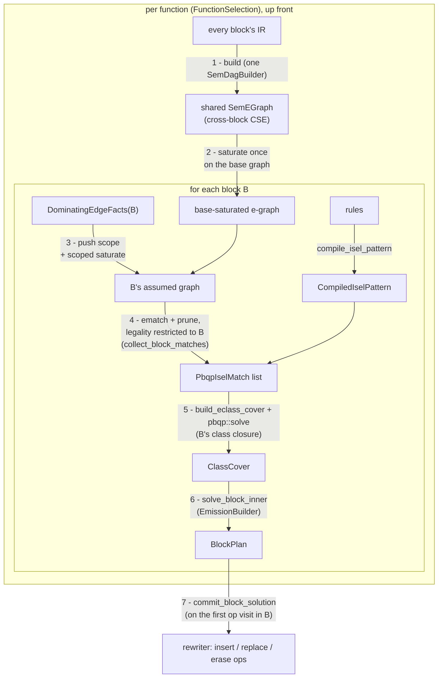

# Instruction Selection

Instruction selection (`core/src/backend/isel/`) turns target-independent IR
into target instructions. It is **e-graph + PBQP**: the whole function is lowered
into one shared semantic e-graph, saturated with proved algebraic identities, and
tiled against the target's instruction patterns; each block is then covered
*separately* — the cheapest legal cover found by solving a Partitioned Boolean
Quadratic Problem (PBQP) — inside an assumption scope carrying the facts of the
guarded CFG edges that dominate it.

Nothing in the pass hardcodes a semantics, cost, or rule. A target supplies a list
of `Rule`s (a semantic pattern + an emitter) and an optional cost model; the pass
does the rest.

## Module layout

| module | responsibility |
|--------|----------------|
| `isel/mod.rs` | public API (`Rule`, `EmitRequest`, cost-model traits), the pass driver, the shared `FunctionSelection`, and per-block solving |
| `isel/node.rs` | the `SemNode` label, `SemPayload`, and e-class helpers (`class_int_binding`, `class_value_binding`, widths) |
| `isel/builder.rs` | `SemDagBuilder`: the function's IR ops → one shared semantic e-graph, including memory effects |
| `isel/pattern.rs` | `compile_isel_pattern`: rule semantics → `tir_symbolic::egraph::Pattern`s + per-node metadata |
| `isel/axioms.rs` | s-expression axioms and their compilation into proved rewrites |
| `isel/synthesis.rs` | offline discovery of bridge axioms by enumeration (`discover_axioms`) |
| `isel/rewrites.rs` | the built-in boolean bridges (`discover_rewrites`), saturation driver |
| `isel/cover.rs` | PBQP construction, match dominance pruning, completeness check |
| `isel/emit.rs` | `BlockPlan` and `EmissionBuilder`: cover → per-op decisions |

## Pipeline



The pass runs per function. Visiting the function op triggers `solve_function`,
which builds one `FunctionSelection` — every block lowered into a single shared,
base-saturated e-graph — and solves **every block up front**, each inside its own
assumption scope (`solve_block`). Solving before any commit is required: a
dominating-edge fact reads a guard condition's *defining op*, which a dominator's
commit would replace. Plans are stored in `plans` keyed by `BlockId`; the first op
the pass later visits in a block triggers `commit_block_solution` (`emitted_blocks`
guards against re-emitting), so building and solving each happen once.

## 1. Building the semantic e-graph

`SemDagBuilder` lowers every op of the **whole function** into one shared
`SemEGraph = EGraph<SemNode>`. There is no separate DAG arena: the e-graph
hash-conses, so it *is* the interned semantic DAG, and identical sub-expressions
across ops — and across blocks — collapse to one e-class (CSE for free). A single
builder instance lowers every block, so its per-value memoization
(`value_to_class`) unifies classes function-wide.

A cross-block operand needs no special handling: the builder's `value_to_def` is
function-wide, so an operand defined in another block expands to its defining
expression like any local one. A value with no defining op — a block argument or
entry input — stays an opaque `Input` leaf (always available in a register).

### What a node is

An e-node is a **label** plus its **operand e-classes**. The label is a
`SemNode`:

```rust
struct SemNode { kind: SymKind, payload: Option<SemPayload>, ty: Option<TypeId>, children: Vec<Id> }

enum SemPayload {
    Expr(SymPayload<ValueId>), // a semantic constant / symbol / value
    Opaque(u32),               // a unique, never-merging marker (see below)
}
```

The operands live inline in `children`, but the label — `(kind, payload, ty)` —
ignores them: `PartialEq`/`Hash` compare only the label, so two e-nodes are
congruent iff they share a label *and* the same canonical operand classes (the
`ENode` contract, which pairs the label with the children). `ty` is the verbatim
IR type (no width normalization), so every target can constrain on the widths it
distinguishes.

```
   add : i32                       a SemNode label is just (kind, payload, ty);
   ┌──────────┐                    operands are edges to child classes
   │ kind=Add │
   │ ty =i32  │ ──┬──► class[x]    (symbol, ty=i32)
   └──────────┘   └──► class[y]    (symbol, ty=i32)
```

`SymKind` / `SymPayload<ValueId>` come from each op's `semantic_expr` (the sem-DSL), so a
multi-node expansion (e.g. a load becomes `LoadMemory(add(addr, 0), bytes,
meta)`) lands as several e-nodes.

### Opaque payloads: things that must never merge

`SemPayload::Opaque(serial)` makes a node label unique, defeating hash-consing
and saturation's congruence repair, while still matching any untyped pattern
node of the same kind (a pattern payload of `None` is a wildcard). It is used
for:

- **un-lowerable sub-expressions** (`add_opaque`): two unknown computations are
  never assumed equal;
- **memory effects and their addressing wrappers** (`add_op_unique`): loads are
  not pure values (two loads of one address differ across an intervening
  store), so their e-classes must never merge; the synthetic `addr + 0`
  wrapper stays private to one memory op for the same reason.

### Memory ops

Ops implementing `MemoryRead` / `MemoryWrite` are lowered by
`build_memory_effect` into `LoadMemory` / `StoreMemory` nodes whose address is
wrapped as `addr + 0` so the targets' base+offset addressing patterns
match a bare pointer. The interfaces are the only trigger; there is no op-name
matching. `class_is_pure` also treats the atomic and synchronization kinds
(`LoadReserved`, `StoreConditional`, `AtomicRmw`, `Fence`) as impure, so like
plain loads and stores their classes never merge or duplicate.

### Side tables produced by the build

The tables are function-wide and **multi-valued**: a class may root ops in several
blocks and carry several equal values, so the maps keep every candidate rather than
one earliest winner. Every id is canonicalized through `egraph.find` after
saturation (which may merge classes). All live on `FunctionSelection`.

| table | meaning |
|-------|---------|
| `ops_by_root: Id → Vec<OpId>` | every op whose canonical root is the class, across all blocks |
| `op_root: OpId → Id` | every lowered op's canonical root class (total) |
| `class_values: Id → Vec<ValueId>` | every IR value a class computes (input leaves it interned + every op result rooting it), sorted and deduped for a deterministic binding order |
| `op_position: OpId → usize` | an op's index within its own block (orders same-block candidates) |
| `value_to_def: ValueId → OpId` | the op defining each value (function-wide) |
| `value_block: ValueId → Option<BlockId>` | a value's def block, or `None` for a block argument / entry input |
| `externally_bound: Set<ValueId>` | a value with at least one original use **outside its def block** — guaranteed materialized in a register, so a dominated block may bind it |
| `shared_classes: Set<Id>` | a value used as an operand by **>1 consumer** (counted function-wide); a memory effect here can never be internalized into a larger match (a pure value still can — duplication) |
| `must_materialize: Set<Id>` | an op-root class whose value some consumer can never internalize: **(a)** a use in a different block (exactly `externally_bound`), or **(b)** a same-block use no match reaches that is not a guarded terminator; it is never offered a consuming alternative |
| `guards` / `jumps: BlockId → Vec<…>` | each block's guarded two-way terminators (with the condition's class) and plain unconditional branches |
| `prepared: ValueId → ConditionExpr` | each dominating-edge condition prepared against the base graph (its class, and its defining comparison when there is one), so a block's scope can assert it |

Because scoped assumptions merge classes, a per-block query through the *scoped*
representative must reach every base key it covers. `FunctionSelection::base_members`
returns the base ids a scoped-canonical class covers (the scope's partition members,
or the class itself when no scope is open); every table lookup (`is_op_root`,
`is_shared`, `has_values`, `requires_materialization`, register binding) aggregates
over them.

## 2. Saturation with proved rewrites

Before tiling, the e-graph is saturated with target-independent algebraic
identities (`self.rewrites`). These are **not** hand-written selection rules — they
are bit-vector lemmas the target's own instructions happen to realize, expressed
as s-expression axioms (`isel/axioms.rs`):

```
(axiom sext-bridge
  (vars (x n)) (root w) (where (< n w))
  (lhs (sext x w))
  (rhs (ashr (shl x (- w n)) (- w n))))
```

Nobody writes these by hand either: the `tir axioms` developer utility
*discovers* them (`isel/synthesis.rs`) whenever a backend's instruction set
changes. Discovery enumerates candidate terms over the target's atomic
instruction kinds, directly in the axiom language (constant leaves are width
expressions, so candidates are width-parameterized by construction), prunes by
behavioral fingerprint over sampled inputs at several `(n, w)` pairs, and
accepts the smallest candidate the `SmtOracle` proves at every sampled pair.
The result is committed as `backends/<t>/src/isel.axioms`, installed by the
backend through `with_axioms`, and guarded by a per-backend freshness test
that re-runs discovery and diffs the file. `with_axioms` drops any axiom whose
RHS needs a kind the rule set has no atomic instruction for, so a stale file
degrades coverage, never correctness.

The compiled applier resolves the axiom's width names from the matched classes
(`n` from `x`'s class, `w` from the root), checks the guards, and **proves the
exact width instantiation** with the `SmtOracle` (an unsat check through
`tir-symbolic`'s QF_BV bit-blaster, memoized per instantiation) before it
unions — so there is no gap between the lemma proved and the rewrite applied.
The proof models each operand as the low `n` bits of a full-width register the
RHS reads whole, covering the undefined upper register bits the emitted
instructions actually see. The extension axiom asserts:

```
   SExt(v, W)   ──rewrite──►   ShiftRightArithmetic( ShiftLeft(v, W-n), W-n )
                                                            with n = width(v)
```

After `egraph.union`, the `SExt` class *also contains* the shift-pair form, so a
target with no sub-word sign-extend instruction can still cover it via shifts. The
introduced shift nodes are untyped, so they match width-agnostic shift patterns.

> Saturation may merge classes, so `ops_by_root`, `class_values`, and the other
> side tables are re-canonicalized through `egraph.find` afterwards; each keeps
> **every** merged candidate (multi-valued, see §1). This base saturation runs
> once per function; a fact-bearing block re-saturates inside its own scope.

## 3. Patterns and matches

Each `Rule`'s pattern is compiled once (`compile_isel_pattern`) into a
`tir_symbolic::egraph::Pattern<SemNode, u32>`. Operand leaves become
`Var::Symbol` holes (capture points — the match's substitution binds them);
interior nodes become typed/untyped templates, with per-node register /
immediate / width requirements kept in `node_meta`. `specificity` counts
type-constrained nodes — the tie-breaker (see below).

`collect_block_matches` e-matches every value pattern against the shared e-graph
(via the `tir_symbolic::egraph` search engine — the same matcher instcombine uses
— with operand constraints and match legality supplied as a legality callback),
then **restricts every hit to the solving block B**: a match survives only if its
root is a value B computes (an op of B, a guard condition of B, or a
rewrite-introduced intermediate reached from B), its non-pure interior classes are
backed by ops **in B** and unshared, and every boundary operand is *resolvable at
B* (the binding rule below). A hit outside this closure belongs to another block's
solve. It produces a `PbqpIselMatch` per surviving hit:

```rust
struct PbqpIselMatch {
    pattern_index, rule_index,
    root: EClassId,           // class this match would compute
    pattern_root: NodeId,
    bindings: FullMatchBindings,  // pattern_node → class, + symbol → class captures
    cost: u64,                    // the cost model's node cost, unmodified
}
```

A match rooted at a pure operand (leaf/constant) is discarded — instructions root
at *computed* values only. A pure class may sit interior to any number of
matches (each fused instruction recomputes it); a shared *memory effect* (§1)
is allowed as a match root or boundary, but never as an interior node a larger
match would erase.

The function-wide legality (boundary constraints, pure-or-op-root interiors) does
not depend on the assumption scope, so a **fact-free** block sees exactly the base
graph: its patterns are searched once for the whole function
(`base_value_matches`) and each such block reuses that superset, narrowing it to
its own op-roots. A **fact-bearing** block re-searches under its scope.

### Width-sensitive operands

A boundary may carry a **width requirement** (`Rule::with_operand_widths`,
compiled to `Pattern::operand_width`): the bound class must hold a value of
exactly that width, or one of *unknown* width (a rewrite-introduced
intermediate, produced at register width by whatever materializes it). TMDL
derives these for operands whose upper register bits reach the result —
comparison operands always; right-shift values and division/remainder operands
under an *untyped* node (a typed word form like `sraw` already pins its
operands through width inference) — resolving the width from the operand's
register class per enabled features (XLEN: 64 on rv64, 32 on rv32). So an i32
compare fuses into `blt` on rv32 but is *refused* on rv64 (a 64-bit compare
would read undefined upper bits) instead of miscompiling.
Low-bits-preserving operators (add/and/shl/mul-low) stay width-agnostic.

### Float operands

A boundary may carry a **float requirement** (`Rule::with_operand_floats`,
compiled to `Pattern::operand_floats`): the bound class must not hold a value
whose IR type kind is the opposite — an integer operand refuses a float value
and a float operand refuses an integer one, so a store never consumes a float
and an `fadd` never consumes an integer. `class_is_float` reads the kind off
whichever member carries a known integer or float type; a class of unknown type
(a rewrite-introduced intermediate) matches either. Rewrite-introduced float
nodes get their type from `type_for_kind_width`, which maps the arithmetic float
kinds (`FAdd`/`FSub`/`FMul`/`FDiv`) at width 32/64 to `f32`/`f64`.

### Immediate ranges

An immediate boundary additionally carries its **encoding range**
(`Rule::with_operand_imm_ranges`): the field's bit width from the TMDL operand
type (`imm: bits<12>`), signedness from how the behavior consumes the symbol
(`sext(imm, _)` is signed, everything else unsigned), and an
`extract(imm, hi, 0)` shift-amount mask narrows the usable bits. A constant
outside the range must not bind — its encoding would silently truncate — so
`addi x, 2047` folds while `addi x, 2048` refuses the immediate rule (and,
with no wide-constant materializer in the rule set, fails selection loudly).

### Narrow register-width forms

An instruction whose destination register class is statically narrower than
the architectural registers (x86 `add32`/`add16`/`add8` on
`GPR32`/`GPR16`/`GPR8`) defines exactly that many bits: TMDL types the
pattern root at the class width, so each narrow form matches only values of
its width and wins the specificity tie-break below against the untyped
full-width form (which keeps matching every other width).

### Dominance pruning (specificity)

Before the solve, `prune_dominated_matches` deduplicates interchangeable
matches: among matches with the same root class, the same internal-class
coverage, and the same boundary operands, the one that is no cheaper *and* no
more specific is dropped. So at **equal cost** the type-constrained rule wins
(an `i32 addw` beats the untyped `add`), while a genuinely cheaper instruction
still wins on cost alone — and specificity never distorts the PBQP objective.

## 4. The PBQP cover

`build_eclass_cover` maps the tiling problem onto PBQP over a **supplied class
list** — B's op-root and guard-condition classes closed under the surviving
matches' bindings (`closure_classes`), so rewrite-introduced intermediates reached
from B are covered but nothing from another block is. **One PBQP node per class in
that closure**, each offering a set of **alternatives**:

```
   PbqpIselAlternative
   ├─ External                       leaf, or a value materialized in a register
   ├─ Root { match_id }              this class is the instruction's result   ← cost lives here
   ├─ Internal { match_id, p_node }  this class is an interior node of that match (cost 0)
   └─ Dead                           value not needed in a register: its only consumer is a
                                     fused conditional branch (cost 0; never satisfies a
                                     boundary's materialization requirement)
```

Only the **Root** alternative carries the match's cost; interior nodes are free
(the paper's convention). A match's root and its *memory-effect* internals are
held together by a **coherence set**; pure internals are exempt — the
instruction recomputes them (duplication), so the match stays selectable even
when the class is claimed by another match or materialized in its own right.
Classes in `must_materialize` are never offered Internal alternatives at all.

Edges connect each match's **root class to every class the match binds**, so
the match's requirements don't depend on the choices of intermediate pattern
nodes. The compatibility matrix sets `INF_COST` for incoherent pairs and asks
`alternatives_compatible` (via `child_requirement`):

```
   parent Root/Internal expects a class its match binds to be …
   ├─ Materialized   (bound under a Boundary)  → child must be Root or External
   ├─ SameMatch      (a memory-effect interior node) → child must be exactly
   │                                                    that Internal{match,node}
   └─ nothing        (a pure interior node) → any choice; the instruction
                                              recomputes the value (duplication)
```

`pbqp::solve` returns the min-cost assignment as a `ClassCover` (one chosen
alternative per class).

### Worked example: `square` lowering

`extsi(addi(a, b) : i16) : i64` with RV-style rules `add`, `slli`, `srai`:

```
  build + saturate                        cover                       emit
  ─────────────────                       ─────                       ────
  Add(a,b) : i16   ◄── ops_by_root         Root: add        ─────────► addi
       │                                                                │
  SExt(·, 64): i64 ◄── ops_by_root         class also holds            (interior
       │  saturate adds ▼                 srai(slli(·,48),48)          slli has
  ShiftRightArith( ShiftLeft(·,48), 48)   Root: srai                   NO op →
              ▲ introduced (no op)        Root: slli (introduced) ───► introduced
                                                                        emit before
                                                                        srai)
                                          ──────────────────────────► addi, slli, srai
```

The `slli` e-class came from saturation and backs no original IR op, so the
`EmissionBuilder` materializes it as a fresh-valued instruction inserted *before*
its consumer (an `IntroducedEmit`).

## 5. Planning emission

`solve_block_inner` reads the cover into a `BlockPlan`:

```rust
struct BlockPlan {
    op_decisions: HashMap<OpId, BlockDecision>,   // Emit{rule,match} | Consume
    introduced: Vec<IntroducedEmit>,              // operand-first order
    terminators: Vec<TerminatorPlan>,             // guard / jump lowerings
}
```

- A class chosen **Root** and backed by an op → `Emit` that op with the rule.
- A class chosen **Internal** and backed by an op → `Consume` (erased; folded into
  its parent instruction).
- A **Root** class with no backing op → an `IntroducedEmit` (the saturation `slli`).

`EmissionBuilder::resolve_match` turns a chosen match into a concrete
`RuleMatch` — the symbol→operand bindings the emitter reads. Each capture resolves
to an introduced operand's fresh value if the cover materialized one, else through
the shared resolver (`resolve_binding`) to a constant immediate and/or a register
value legal at B (see [Binding resolution](#binding-resolution)); a class carrying
both records both.

`completeness_error` runs **before** solving and checks only **B's** op-root
classes: each non-terminal one must be a Root or interior of *some* match (or an
exempt fused-branch condition), else selection fails naming the unsupported
`SymKind` ("missing atomic materializer rule for semantic kind …"). This is how an
incomplete rule set is rejected instead of silently dropping an op.

## 6. Committing

`commit_block_solution` applies the plan through the `Rewriter`:

1. Insert each `IntroducedEmit` before its anchor (operand-first). Its
   `EmitRequest` carries only the fresh destination value (`op: None`).
2. Lower the `terminators` (guards / jumps) first, ahead of the op loop: a
   fused conditional branch reads its operands as *values*, so the condition's
   defining op — possibly erased as `Dead` below — must lose its last use first.
3. For each original op, in **reverse block order** (consumers before defs, so
   a def's `replace_op` use-remapping sees every already-emitted consumer):
   `replace_op` (Emit) or `erase_op` (Consume).
4. Drop `constant` ops left dead — an immediate folded into an instruction
   attribute detaches the constant's only use, so the maintained def-use chain
   reports zero uses and it is erased.

## Conditional branches

Terminators select through the same rule machinery when the target installs
`BranchEmitters` (`with_branch_emitters`): an `uncond` emitter (e.g. `vbr`,
finalized to `jal x0` post-RA) and a `cond_nonzero` **safety fallback** returning
the instruction(s) that branch on a nonzero register (one op on targets with a
zero register — `bne cond, x0`; a flag-setting test plus the branch on flag
targets — `test cond, cond` + `jne`, `cmp cond, xzr` + `b.ne`). Every target now
*derives* an equivalent zero-compare branch (see [Zero-compare
branches](#zero-compare-branches)), so `cond_nonzero` is unreachable in practice
— it stays installed only as a last resort.

TMDL derives a **branch rule** (`RuleKind::CondBranch { target_symbol }`) from
any instruction whose behavior is a guarded PC write:

```
   if rs1 < rs2 { PC::pc = PC::pc + sext(imm, XLEN) }   →   pattern Lt(s0, s1),
                                                            target_symbol = imm
```

The pattern is the *branch condition*; the taken target is bound at emit time
as a Block attribute (`RuleMatch::block_binding`). Each guarded terminator
(`BranchGuard`, e.g. `cond_br`) has its condition lowered into the shared e-graph
when the function is built. At solve time the branch rules are e-matched once for
the whole block and indexed by condition class (`guard_branch_hits`); each guard
then looks up its own hits and `best_guard_branch` picks the cheapest match rooted
at its condition class whose operands all resolve at B (tie → most specific):

- **Fused**: the branch instruction recomputes the condition from its operand
  registers (the match's boundary classes join the block's materialization
  overlay `mm_overlay`). The
  condition class gets a `Dead` alternative — if nothing else needs the value,
  the compare op is Consumed; a boundary edge from any chosen match forbids
  `Dead`, so a multi-use compare is still materialized (`slt`) *and* fused.
- **Fallback**: no branch rule matches — the condition is forced materialized
  and `cond_nonzero` emits the branch. A bare i1 condition (block/function
  argument, no comparison) no longer reaches here: the bridge below hands it a
  derived zero-compare branch, so the fallback is reserved for conditions no
  derived rule covers.

Either way the terminator is replaced by the branch (inserted ahead of it)
plus `uncond` to the false successor; a plain `br` lowers through `uncond`
directly. `cmpi` participates via its predicate-dependent semantic expression
(canonicalized so only `Eq/Ne/Lt/Ge/ULt/UGe` appear — `sgt`/`sle`/… swap
operands), and a proved width-1 identity
`c == If(c, 1, 0)` (any 1-bit `c`) bridges a bare comparison class to the
`slt`-style `If`-patterns so a compare used as a *value* materializes with no
hand-written rule.

Instructions that read or write the PC *unconditionally* (`jal`, `jalr`,
`auipc`) get **no value rule**: their pattern would hide the control-flow
effect (a `jal` rule would match a plain `x + 4`). Returns and calls remain
per-target op lowerings.

### Zero-compare branches

Two idioms branch on whether a value is zero without materializing the zero: a
bare i1 condition and a `cmpi x, 0` guard. Both are served by *derived* rules,
so `cond_nonzero` is now a fallback of last resort.

`bridge_zero_branch_guards` (`isel/mod.rs`) runs after saturation, over
guard-condition classes only, and injects the shape the derived rules match:

- a bare 1-bit class with no comparison to fuse gains `Ne(c, zext(0b0, 1))`
  (trivially true for a 1-bit value) — a lone `Symbol` leaf otherwise roots no
  `CondBranch` pattern;
- a comparison against a proven-zero constant `Cmp(a, 0)` gains `Cmp(a,
  zext(0b0, W))`, the zero operand replaced so the surviving operand binds from
  the match while the zero wires to a zero register.

Restricting the injection to guard classes keeps unrelated width-1 classes from
gaining a spurious comparison member; a target with no matching rule leaves the
extra member unmatched.

TMDL derives the rules these unify with. On a register class carrying a
**hardwired-zero** register (the `hardwired_zero` trait — RISC-V `x0`), every
two-register comparison branch also yields per-slot **zero-form** variants that
wire one operand to that physical register, the zeroed slot lowered as
`zext(0b0, W)`; so `beq/bne/blt/… x0` all derive and cover both idioms directly.
On arm64 the `cbz`/`cbnz` path emits the same `zext(0b0, W)` shape, so `cmpi x,
0` and a bare i1 both select `cbz`/`cbnz`.

Branch-rule matching additionally lets a width-1 class bind a register-width
operand: `CompiledIselPattern::search` (`isel/pattern.rs`) passes
`bool_binds_wide` through `boundary_ok_impl`, relaxing the width check for a
1-bit class. A materialized i1 occupies its register as 0/1 and the branch reads
the same bits the fallback would test, so a bare i1 reaches the register-width
zero-compare rule. The relaxation is scoped to branch-rule search, not general
boundary filtering.

### Flag-mediated branches (x86 EFLAGS, AArch64 PSTATE)

On flag architectures the branch condition is not a function of the branch's
own operands: a compare writes condition-code registers (`cmp` sets
`PSTATE::n/z/c/v` or `EFLAGS::cf/zf/sf/of`) and the conditional branch guards
on them (`if PSTATE::n != PSTATE::v { PC::pc = ... }`). TMDL marks such
registers with the `status_flag` trait and derives branch rules by
**composition**: for every *flag definer* (an instruction whose behavior
assigns only status-flag registers of one class, each flag a pure function of
its encoded register operands) paired with every *flag-guarded branch* (a
guarded PC write whose condition reads only that class), the definer's
per-flag expressions substitute into the guard, producing a condition over the
definer's operands:

```
   b.lt:  if n != v { PC::pc = ... }         cmp:  n = extract(rn - rm, 63, 63)
                                                   v = extract((rn^rm) & (rn^(rn-rm)), 63, 63)
   compose:  extract(rn-rm,63,63) != extract((rn^rm)&(rn^(rn-rm)),63,63)
```

The composition is then matched against the six canonical comparisons (both
operand orders) the same way discovered rewrites are confirmed: a fuzz filter
picks the candidate, and the `SmtOracle` **proves** the equivalence by
bit-blasting at the operands' architectural width. Above, the sign/overflow
formula proves equal to `Lt(rn, rm)` — nothing recognizes the idiom
syntactically, so any correct flag formulation derives, and a wrong one
derives *no* rule instead of a miscompiling one. The proved comparison becomes
the rule's pattern; emission produces **two real instructions** — the rule's
`prelude_emit` builds the flag definer (binding the compared operands), then
`emit_fn` builds the branch (binding the taken target) — inserted adjacently
ahead of the terminator. Everything else (the `Dead` alternative consuming the
compare, boundary-forced materialization, dominating-edge assumptions) is the
same machinery as the fused single-instruction path.

A guard matching no canonical comparison (e.g. a branch on overflow alone)
derives no rule; the instruction still assembles, encodes, and simulates.

The same composition also materializes a flag *reader* (`cset`, `setcc`) — an
instruction that computes a value from the condition-code bits. Such an
instruction derives **no plain value rule** (`behavior_reads_flag_register`
gates it in `rustgen.rs`): lifting its flag reads into free operands yields a
pattern structurally identical to a comparison (`If(Eq(s0, s1), 1, 0)`), and —
value rules get no SMT proof — it would match `cmpi` and bind the flag operands
to garbage (this was a real arm64 miscompile: a bogus `cset_ge` value rule
matched integer `Eq` and dropped its operands). Instead `emit_flag_reader_rules`
composes each definer with each reader — the definer's per-flag semantics
substitute into the reader's condition, and when the composite SMT-proves equal
to one canonical comparison the pair registers an `If`-rooted **value** rule
whose prelude emits the definer (`cmp`) ahead of the reader (`cset.<cc>`). The
value-commit path honours `prelude_emit` for value rules (`isel/mod.rs`),
inserting the definer before the materializer. The reader's arms are reused
verbatim, so the pattern is the width-polymorphic `slt`-style `If` the
bool-materialize bridge already matches — the flag-arch analog of a compare
materializing with no hand-written rule. A two-register `cmpi` as a value now
emits `cmp` + `cset.<cc>`.

**Immediate definers.** `analyze_flag_definer_semantics` accepts one `Bits`/
`Integer` operand alongside the register operands, so `cmp r, imm` composes into
an immediate compare-and-branch (and, through the reader path, an immediate
materializer). The immediate binds the operand directly (an `Immediate` operand
constraint), its SMT proof width taken from the paired register operand (the
shared architectural width). A #204 imm-range constraint on both the branch and
reader composition paths refuses a constant outside the field's signed range —
falling back to a hard error rather than truncating. The fused-branch base cost
now counts both emitted instructions (`+2`), so a single-instruction direct
branch (`cbz`) still wins the zero case. Result: x86 `cmp x, K` + jcc and arm64
`cmp Xn, #imm12` + b.cc derive.

**Aliased test-zero branches.** A two-register definer whose slots are *both*
bound from one matched value (`test c, c`, setting the flags of `c & c`)
composes with a flag-guarded branch into a single-symbol-vs-zero condition
(`Ne(c, 0)` / `Eq(c, 0)`), SMT-proved at the operand width
(`emit_aliased_zero_branch_rules`). Emitted in the bridge's `zext(0b0, W)` zero
shape, the pair covers a bare boolean guard with a derived `test c, c` + `jne`/
`je`, so x86 selects a bare i1 with no hand-written fallback. Its larger pattern
costs more than the immediate compare, so `cmpi x, 0` keeps selecting `cmp x, 0`;
only a bare i1 (nothing to fuse) uses the `test` form. With this every target's
bare-i1 path is derived, and the `cond_nonzero` hooks are unreachable safety
fallbacks.

## Implicit register reads (demand attributes)

A register a behavior reads by path without it being an encoded operand (RVV
`VCSR::vl`, `VCFG::sew`) is a real dependency. The read becomes a pattern
symbol like any operand, and the generated emitter stamps whatever the symbol
bound — an immediate or a virtual register — onto the selected op as a
*demand attribute* named after the register (`vl = 4`, `sew = 32`, with a
`Use` role for register values). Selection never materializes the register's
definer; a target machine pass does (RISC-V `riscv-insert-vsetvli` tracks the
configured state forward through each block and inserts `vset{i}vli` exactly
where the demanded configuration changes). Demand attributes are to that pass
what virtual registers are to allocation: a recorded obligation, concretized
later.

## Dominating-edge assumptions (scoped shared graph)

A guarded CFG edge `u → v` carries the fact `condition == holds`. When `v` is a
non-entry block entered through **exactly that one edge**, "the edge dominates"
collapses to "`v` dominates", so the fact holds throughout `v` *and every block `v`
dominates* (the standard dominated-equality argument). The `DominatingEdgeFacts`
analysis (`core/src/analysis/edge_facts.rs`) computes these: `own_fact(block)` is
the fact `block` contributes, and `facts(block)` gathers the own facts of every
dominator up the `idom` chain, **outermost first**. It generalizes isel's former
single-edge, single-block rule to the whole dominator subtree.

Because every block solves against the *one shared* graph, a block's facts are
asserted in an **assumption scope** (`push_context`) private to its solve. The
scope may hold **several** facts (one per dominating guarded edge); `assert_fact`
applies each, reading the condition's `prepared` `ConditionExpr`:

- the condition class ≡ its known truth value (0/1),
- the defining comparison ≡ the same truth, its *complement* comparison
  (`!(a<b)` is `a>=b`) ≡ the opposite,
- an `eq`-true / `ne`-false fact additionally asserts `lhs ≡ rhs`, so scope
  congruence merges everything computed from equal operands.

After asserting, the block `rebuild`s and **saturates inside the scope**, so the
rewrites propagate the facts. Consequences then fall out of the ordinary
machinery: a re-computed identical (or complement, or operand-swapped-under-`eq`)
compare's class now holds a constant, so its guard folds to an unconditional
`Jump` and the compare op is Consumed; a value consumer folds the known immediate
(`RuleMatch` records *both* the int and register binding when a class carries
both). The scope is popped once the block's plan is stored, leaving the shared
graph assumption-free for the next block.

A scoped assumption may merge a class over several base keys. Because the side
tables are keyed by base representatives, every per-block query aggregates over
`base_members` (the scope's partition members of the scoped-canonical class, §1),
so a query through the scoped representative still sees each base key it covers.
This is the shared function-level graph the earlier per-block design anticipated —
now realized, solving one block under its edge facts while the base graph stays
untouched.

## Binding resolution

Because matches now come from a function-wide graph, resolving a boundary class to
an operand for a consumer op `C` in block `B` is the **one cross-block correctness
rule**. One resolver (`resolve_binding`) backs boundary filtering (§3), guard
selection, and emission (§5), so a match accepted at collect time always resolves
at emit time. For a class:

1. an integer constant in the class → an **immediate** (unchanged from before);
2. otherwise a register value `V` from the class's candidates, choosing the first
   legal under, in preference order:
   - a same-block def **preceding** `C` (`is_before`), earliest first, then
   - a **block argument / entry input** (always in a register), then
   - a def in a **strict dominator** of `B` that the original IR already used
     across blocks — i.e. `V ∈ externally_bound`, so it is guaranteed
     materialized (closest dominator first, via `dom_distance`).

A class may resolve to both (an assumption merged it with its truth constant). A
class with candidate values but none legal — its only register candidate is a
cross-block **non-escaping** value — is *unresolvable*; a match with such a
boundary is discarded.

**Future work (out of scope):** rebinding a cross-block register read to a
non-escaping dominating value would require **plan-to-plan requirement
propagation** — a consumer's plan telling the defining block's plan to materialize
a value the original IR never forced into a register. Deferred; today such a value
is simply left standalone.

## Cost model

A target may install an `IselCostModel` (`with_cost_model`); its single hook,
`node_cost(context, op, rule, match)`, prices the Root alternative of an
op-backed match. The default is the rule's TMDL-derived `base_cost`, which is
also what a rewrite-introduced match (no backing op) always costs. Costs enter
PBQP unmodified; equal-cost ties between interchangeable matches are resolved
by dominance pruning (§3), not by cost tweaks.

## Emitters

Each rule's emitter is
`fn(&Context, &EmitRequest, &RuleMatch) -> Result<Box<dyn Operation>, PassError>`:

```rust
struct EmitRequest<'a> {
    op: Option<&'a OperationRef>, // None for a rewrite-introduced instruction
    results: &'a [ValueId],       // destination values
    result_ty: Option<TypeId>,
}
```

By convention an emitter writes its destination *into the original result
`ValueId`* (TMDL-generated emitters store it as the destination register
attribute), so consumers and later passes keep referencing the same values.
`replace_op` only rewrites SSA uses when the old and new ops declare the same
number of results; machine ops declare none, so the original values stay live
and the Def-role register attribute claims their def-site.

## Key types at a glance

| type | role |
|------|------|
| `SemNode` | e-graph label: `(kind, payload, ty)` |
| `SemDagBuilder` | lowers the whole function's ops into one shared e-graph |
| `Rule` | a target's pattern + emitter + base cost + operand constraints |
| `CompiledIselPattern` | a rule's pattern compiled for e-matching, with per-node metadata + specificity |
| `PbqpIselMatch` | one e-match hit: root class, bindings, cost |
| `FunctionSelection` | the function's shared e-graph + multi-valued side tables + every block's plan |
| `DominatingEdgeFacts` / `EdgeFact` | guarded-edge facts inherited down the dominator tree |
| `BlockPlan` / `IntroducedEmit` | the emission plan and its synthesized instructions |
| `EmissionBuilder` | turns a cover into per-op `RuleMatch`es, materializing introduced classes |
| `EmitRequest` | what an emitter writes into: backing op (if any) + destination values |
| `IselCostModel` | target hook for match cost (`node_cost`) |
